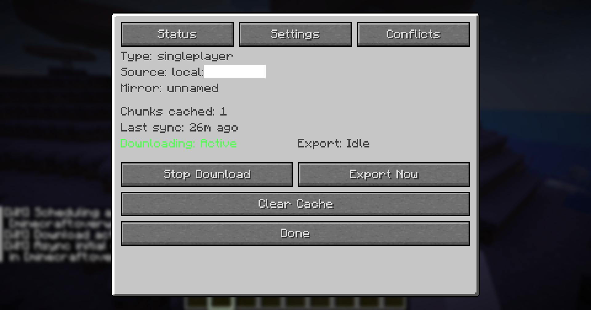
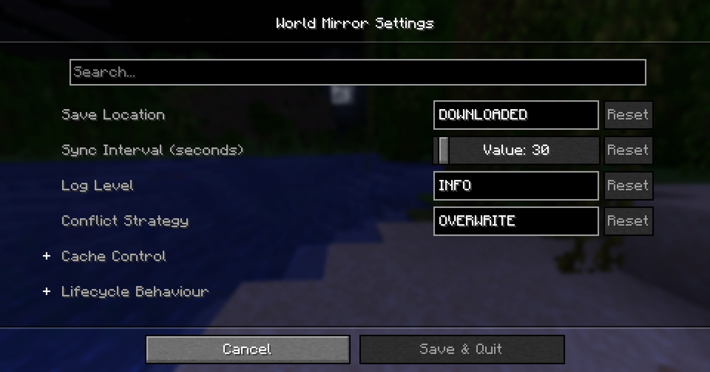

# World Mirror

**Version:** 0.2.2 · **Minecraft:** 1.21.11 · **Loader:** Fabric

A client-side Fabric mod that silently mirrors the world you are playing on a multiplayer
server — or even a singleplayer world — into a fully loadable local copy.  As you explore,
the mod captures chunk terrain, entities, and container contents and writes them to a
region-file save that you can open immediately in singleplayer.

---

## Features

| Feature | Description |
|---------|-------------|
| **Persistent download session** | Press **P** to start or stop a download session. Chunks received from the server are recorded automatically while the session is active. |
| **Periodic background sync** | The mod exports to disk on a configurable timer (default 10 s) without freezing the game. |
| **Dirty-chunk tracking** | Only chunks that have changed since the last export are written, keeping sync fast even for large worlds. |
| **Multi-dimension support** | Overworld, Nether, End, and any custom dimension are captured in Minecraft's standard save layout with separate `region/`, `entities/`, and `poi/` subdirectories. |
| **Entity capture** | All non-player entities in captured chunks — mobs, animals, paintings, item frames, armour stands, dropped items, vehicles, etc. — are serialized using Minecraft's own `saveWithoutId` and written to the dimension's `entities/` region files. |
| **Container tracking** | The mod intercepts inventory packets when you open a chest, barrel, hopper, furnace, or any other container and saves the item stacks. They are merged into the block entity NBT on export. Double chests are handled correctly (each half is saved to its own position). |
| **Block entity data** | Signs (text), beacons (effects), banners (patterns), player heads (owner), lecterns (stored book), and all other block entities whose data the server sends to the client are persisted through Minecraft's chunk serialization path. |
| **World–mirror mapping** | Every server address or singleplayer world name is mapped to a sanitised local folder name, stored in `config/worldmirror/mirrors.json`.  The same server always exports to the same folder. |
| **Per-world settings** | Save location and conflict strategy can be overridden per world from the status screen without touching the global config. |
| **Conflict resolution** | Three built-in strategies for chunks that already exist on disk: *Overwrite* (default), *Ignore* (keep local), and *Manual* (save the server chunk to `conflict_chunks/` in MCA format for later review). |
| **Chunk Map (Window 1)** | Full-screen draggable grid map showing every recorded chunk's download status. Color-coded: green (fresh) → blue (logarithmic, based on age) — downloaded via `world_mirror`. Orange — written by a third-party source (e.g. `player`, `map_hp`). Red border — chunk has an unresolved conflict. Built-in map rendering is optimized with status caching and merged boundary rendering to reduce dense UI drawing cost. Per-chunk conflict resolution dialog (Overwrite / Discard / Cancel). |
| **Xaero's World Map Overlay** | Render World Mirror status fills and merged boundaries directly on Xaero's fullscreen map if Xaero's World Map is installed. |
| **Export Nearby Region** | Snapshot all loaded chunks within a configurable radius (1–50 chunks) into a fresh singleplayer save with the spawn point set to your current position. |
| **In-game status screen** | Press **I** to open a LibGUI status panel showing source info, sync statistics, download state, conflict counts with bulk resolution buttons, and per-world setting overrides. |
| **In-game logging** | Important events are echoed to the player's chat at a configurable level (Debug / Info / Warning). |
| **Mod Menu settings** | All global settings are accessible from the Mod Menu settings screen. |
| **Internationalisation** | UI strings are translated into English (`en_us`), Simplified Chinese (`zh_cn`), Traditional Chinese (`zh_tw`), and Japanese (`ja_jp`). |

---

## Keybindings

| Key | Action |
|-----|--------|
| **P** | Toggle download session on / off |
| **O** | Export cached data to disk immediately |
| **L** | Clear all cached chunks, entities, and containers |
| **I** | Open the in-game status screen |
| **M** | Open the chunk map directly |

All keybindings are rebindable in *Options → Controls → World Mirror*.

---

## In-Game Status Screen (I key)



The status screen shows:

- **Source info** — type (singleplayer / server), source ID, local mirror folder name
- **Statistics** — total chunks cached across all dimensions, time since last sync
- **Live status** — download active/inactive, export running/idle
- **Action buttons** — Start/Stop Download, Export Now, Clear Data, **Export Nearby Region**
- **Conflicts tab** — count of stored conflict chunks, with *Overwrite All* and *Discard All* buttons, plus **Open Chunk Map** to review conflicts per-chunk
- **Per-world settings** — cycle buttons to override the save location and conflict strategy for the current world (stored in `mirrors.json`, takes precedence over global config)
- **Global Settings** — shortcut to the Mod Menu settings screen

---

## Configuration



Open *Mod Menu → World Mirror → Settings* (or click **Global Settings** in the status screen).

| Setting | Values | Default |
|---------|--------|---------|
| Save location | `Downloaded Folder` / `Saves Folder` | `Downloaded Folder` |
| Sync interval | 5 / 10 / 30 / 60 / 120 s | 10 s |
| In-game log level | `Debug` / `Info` / `Warning` | `Info` |
| Conflict strategy | `Overwrite` / `Ignore` / `Manual` | `Overwrite` |
| Xaero overlay | `true` / `false` | `true` |
| Xaero overlay refresh | 1–60 s | 10 s |
| Xaero overlay max cells | 1000–50000 | 6000 |

Configuration is persisted in `<.minecraft>/config/worldmirror.json`.

### Save locations

| Mode | Path |
|------|------|
| `Downloaded Folder` (default) | `<.minecraft>/downloaded_worlds/<mirror-name>/` |
| `Saves Folder` | `<.minecraft>/saves/<mirror-name>/` — immediately playable in the world list |

### Conflict strategies

| Strategy | Behaviour |
|----------|-----------|
| `Overwrite` | Server chunk always replaces the local copy |
| `Ignore` | Local copy is kept; only new chunks are written |
| `Manual` | Local copy is kept; the incoming server chunk is saved to `conflict_chunks/<dim>/r.X.Z.mca` for review. Use the Chunk Map or the Conflicts tab bulk buttons to resolve. |

---

## Output Format

The exported world is a standard Minecraft save directory:

```
downloaded_worlds/<mirror-name>/
├── region/
├── entities/
├── poi/
├── DIM-1/
│   ├── region/
│   ├── entities/
│   └── poi/
├── DIM1/
│   ├── region/
│   ├── entities/
│   └── poi/
├── dimensions/<ns>/<path>/   ← Custom dimensions use region/entities/poi
├── level.dat                 ← Default world properties (created on first export)
├── players/
│   ├── advancements/
│   ├── data/
│   └── stats/
├── data/minecraft/
│   ├── game_rules.dat
│   ├── weather.dat
│   ├── world_clocks.dat
│   └── world_gen_settings.dat
├── data/world_mirror.sqlite         ← Dirty-check and source-priority database
├── resourcepacks/
└── worldmirror_meta.json             ← World Mirror metadata
```

`worldmirror_meta.json` fields:

| Field | Description |
|-------|-------------|
| `modVersion` | Mod version that created / last updated the mirror |
| `sourceType` | `singleplayer` or `server` |
| `sourceId` | World folder name or server address |
| `lastSyncTime` | Unix-millisecond timestamp of the most recent sync |

Per-chunk dirty-check metadata is stored in `data/world_mirror.sqlite`. Older
`worldmirror_meta.json` files with a legacy `chunkUpdateTimes` field are migrated
into SQLite on the first sync after upgrade, and the JSON field is removed.

---

## Entity Serialization

Entities are captured on the game thread before each export, serialized using
Minecraft's own `Entity.saveWithoutId()` method, and written to modern per-dimension
`entities/r.X.Z.mca` files.  All data the client has received via tracking packets is included:

- **Paintings** — painting variant (motive), facing direction, attachment block position
- **Item frames & Glow item frames** — held item (full component NBT), item rotation, fixed flag
- **Armour stands** — all six limb pose angles, equipped armour/hand items, display flags (ShowArms, NoBasePlate, Small, Invisible, Marker)
- **Mobs & animals** — health, actual equipped items, species-specific tracked data (tame state, owner UUID, collar colour, breeding age, saddle, wool colour, etc.)
- **Dropped items** — full item stack with all NBT components
- **All other entity types** — any data the server sends to the client

> **Note:** Fields that are only maintained on the server (AI path nodes, spawn
> reinforcement counters, command-block commands, etc.) are not available to a
> client-side mod and will be absent or default in the exported data.

---

## Block Entity Serialization

Block entities are serialized through Minecraft's chunk saving path
(`getBlockEntityNbtForSaving` / `SerializableChunkData`):

- **Signs / Hanging signs** — front and back text, waxed and glow-ink flags
- **Beacons** — primary and secondary effect IDs
- **Banners** — all pattern layers
- **Player heads / Skulls** — owner profile
- **Lecterns** — stored book item
- **All other block entities** — any state the server sends to the client

Container inventories (chests, barrels, hoppers, furnaces, etc.) are handled separately
by the `ContainerTracker`, which intercepts inventory packets when the player opens each
container during the session. Previously captured non-empty container item data is
preserved when later client block-entity snapshots are empty, and default GUI titles such
as `container.chest` are not persisted as custom names.

---

## Installation

1. Install [Fabric Loader](https://fabricmc.net/use/) ≥ 0.19.3 for Minecraft 1.21.11
2. Install [Fabric API](https://modrinth.com/mod/fabric-api)
3. Install [LibGUI](https://github.com/CottonMC/LibGui) ≥ 15.1.0+1.21.11 (required)
4. *(Optional)* Install [ModMenu](https://modrinth.com/mod/modmenu) for the in-game mod list
5. *(Optional)* Install [Xaero's World Map](https://modrinth.com/mod/xaeros-world-map) for fullscreen map overlay support
6. Drop the compiled JAR file into your `mods/` folder

---

## Typical Usage

1. Join a multiplayer server.
2. Press **P** — the action bar shows *World Mirror: Active*.
3. Walk around to load terrain.  Open containers to capture their inventories.
4. Press **I** to check sync statistics and status at any time.
5. When finished, press **P** again (or let the periodic sync run) — the mirror world is
   saved to `<.minecraft>/downloaded_worlds/<server-address>/`.
6. To play offline: press **O** for an immediate export, then open the world from the
   *Saves Folder* (set save location to `Saves Folder` in settings, or copy the folder
   manually to `<.minecraft>/saves/`).

### Quick export (no session)

Press **O** at any time to trigger an immediate export of whatever chunks are cached,
even when no download session is active.

### Starting fresh

Press **L** to clear all cached data and start a new capture.

---

## Building

```bash
./gradlew build
```

Output: `build/libs/world-mirror-<version>.jar`

---

## Architecture Notes

- All chunk data is captured on the game thread in `ChunkDataMixin` and stored in
  `ChunkListener` (dimension-aware: `Map<ResourceKey<Level>, Map<ChunkPos, CapturedChunk>>`).
- Container data is captured in `ContainerMixin` and stored in `ContainerTracker`.
- Entities are snapshot-serialized on the game thread by `EntityTracker` before each export.
- Built-in and Xaero's map rendering are optimized via a status cache (`ChunkStatusCache` / `ChunkStatusSnapshot`) and merged boundary rendering to minimize GPU and database query overhead.
- Xaero's World Map overlay uses a Mixin to inject World Mirror status rendering directly into Xaero's map GUI.
- The actual disk I/O runs on a background thread (`WM-Export`) to avoid freezing
  the game.  The game thread only provides immutable snapshots of the cached chunks,
  entities, and container overlays.
- Region files are read and written using a bundled fork of
  [ens-gijs/NBT](https://github.com/ens-gijs/NBT) (Querz MCA library).
- The dirty-check (`CapturedChunk.capturedAtMs` vs `data/world_mirror.sqlite`) ensures
  unchanged chunks are not re-written on every periodic sync.
- Uses a bundled fork of [Querz/NBT](https://github.com/Querz/NBT) and [ens-gijs/NBT](https://github.com/ens-gijs/NBT/tree/master) (both MIT license)

## License

MIT

