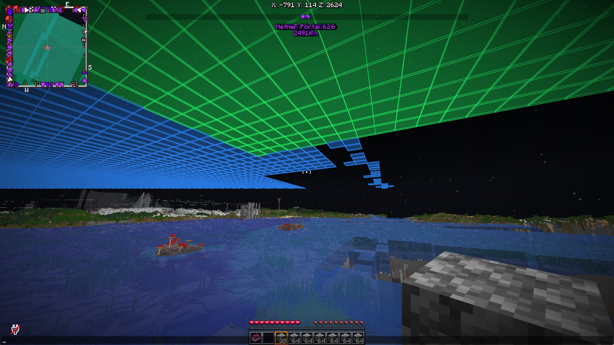
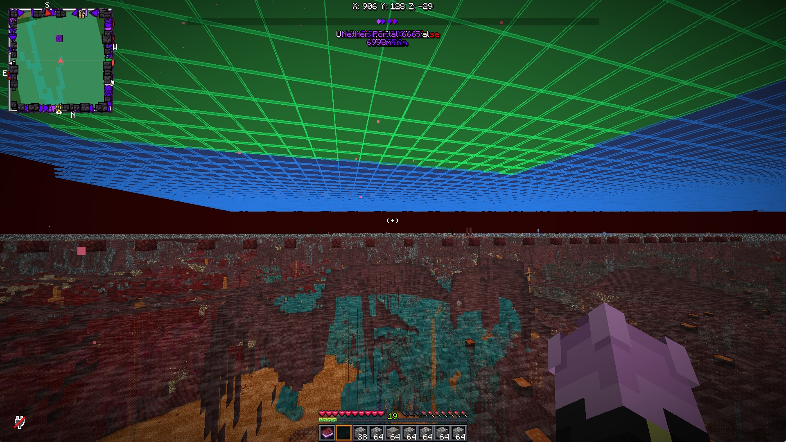

# World Mirror

**Version:** 0.4.4 · **Minecraft:** 1.21.11, 26.1.2, 26.2, 26.3 · **Loader:** Fabric

A client-side Fabric mod that mirrors the world you are playing on a multiplayer server —
or even a singleplayer world — into a standard local save. As you explore, the mod captures
client-visible chunk terrain, block entities, best-effort entity snapshots, and opened
container contents. Choose the `Saves Folder` output mode to make the mirror appear directly
in Minecraft's singleplayer world list.

---

## Features

| Feature | Description |
|---------|-------------|
| **Persistent download session** | Press **P** to start or stop a download session. Chunks received from the server are recorded automatically while the session is active. |
| **Stable and adaptive pipelines** | Hardened periodic sync remains the default. An opt-in adaptive mode reacts to coalesced chunk changes with bounded durability latency. Both use main-thread capture budgets and low-memory, one-region-at-a-time background writes. |
| **Timestamp- and source-aware writes** | SQLite records successful per-chunk write times and source priorities. Older snapshots and updates outranked by a third-party source are skipped. |
| **Multi-dimension support** | Overworld, Nether, End, and custom dimensions are exported using the save layout required by the selected Minecraft version. |
| **Entity capture** | Vanilla-serialized, client-visible non-player entities and passenger trees are merged into per-dimension entity region files. Versioned partial/complete observations reconcile UUID moves and safe despawns without erasing last-known data from unloaded chunks. |
| **Container tracking** | The mod intercepts inventory packets when you open a chest, barrel, hopper, furnace, or any other container and saves the item stacks. They are merged into the block entity NBT on export. Double chests are handled correctly (each half is saved to its own position). |
| **Block entity data** | Signs (text), beacons (effects), banners (patterns), player heads (owner), lecterns (stored book), and all other block entities whose data the server sends to the client are persisted through Minecraft's chunk serialization path. |
| **World–mirror mapping** | Every detected server address or singleplayer world name is persistently mapped to a sanitised local folder name in `config/worldmirror/mirrors.json`. Different aliases for the same server are currently separate source IDs. |
| **Per-world settings** | Save location and conflict strategy can be overridden per world. Time, weather, and difficulty can also be copied manually from the current source world. |
| **Conflict resolution** | Three built-in strategies for chunks that already exist on disk: *Overwrite* (default), *Ignore* (keep local), and *Manual* (save the server chunk to `conflict_chunks/` in MCA format for later review). |
| **Built-in Chunk Map** | Full-screen draggable and zoomable map of recorded chunks. Viewport-indexed snapshots, low-zoom bucket aggregation, and merged boundaries keep large views responsive. Colors show freshness/source; red marks unresolved conflicts. |
| **In-world Chunk Overlay** | Toggleable in-world chunk boxes make coverage easy to follow while exploring. Yellow marks chunks waiting to download, green marks chunks captured in the current session, and blue marks chunks downloaded in a previous session. Adjustable render distance and Y height make it easier to find missed areas and confirm full coverage. |
| **Xaero's World Map Overlay** | Optionally render the same status layer on Xaero's fullscreen map through Xaero World Map Bridge. Xaero's World Map and the bridge are both required for this integration. |
| **Export Nearby Region** | Snapshot all loaded chunks within a configurable radius (1–50 chunks) into a fresh singleplayer save with the spawn point set to your current position. |
| **Native status UI** | Press **I** to open the native Minecraft status screen. It retains download/export status, mirror information, per-world settings, safe mirror relocation, and conflict actions without a LibGui dependency. |
| **Useful, quiet diagnostics** | Operational detail stays in `latest.log`; chat is reserved for translated action results. An opt-in performance switch adds low-frequency pipeline/heap/slow-region telemetry without per-chunk spam. |
| **Cloth Config settings** | Global settings are available from the status screen. Installing Mod Menu also exposes the same screen from the title-screen mod list. |
| **Internationalisation** | UI strings are translated into English (`en_us`), Simplified Chinese (`zh_cn`), Traditional Chinese (`zh_tw`), and Japanese (`ja_jp`). |

---

## Keybindings

| Key | Action |
|-----|--------|
| **P** | Toggle download session on / off |
| **O** | Export cached data to disk immediately |
| **L** | Clear all cached chunks, entities, and containers |
| **I** | Open the in-game status screen |
| **M** | Open the chunk map directly |

All keybindings are rebindable in *Options → Controls → World Mirror*.

---

## In-Game Status Screen (I key)


The status screen shows:

- **Source info** — type (singleplayer / server), source ID, local mirror folder name
- **Statistics** — total chunks cached across all dimensions, time since the last
  successful sync
- **Live status** — download active/inactive, export running/idle
- **Action buttons** — Start/Stop Download, Export Now, Clear Data, **Export Nearby Region**
- **Conflicts tab** — count of stored conflict chunks, with *Overwrite All* and *Discard All* buttons, plus **Open Chunk Map** to review conflicts per-chunk
- **Per-world settings** — save-location and conflict-strategy overrides stored in `mirrors.json`, plus manual time, weather, and difficulty sync actions; moving an existing mirror requires confirmation and is blocked while downloading or exporting
- **Integration status** — output path and Xaero World Map Bridge availability
- **Global Settings** — shortcut to the Cloth Config-generated settings screen

---

## Built-in Chunk Map (M key)


Drag to pan, use the mouse wheel to zoom, and hover a cell to inspect its chunk
coordinates, update age, and update source. The map queries an asynchronous,
viewport-indexed status snapshot rather than the SQLite database from the render loop.
At low zoom it aggregates chunks into bounded buckets and merges same-state runs and
boundaries. Clicking a conflicted chunk opens the **Overwrite / Discard / Cancel** dialog.

---

## Configuration


Click **Global Settings** in the status screen. If Mod Menu is installed, the same screen
is also available from *Mod Menu → World Mirror → Settings*.

| Setting | Values | Default |
|---------|--------|---------|
| Save location | `Downloaded Folder` / `Saves Folder` | `Downloaded Folder` |
| New mirror time | `Follow Current World` / `Morning` | `Follow Current World` |
| New mirror weather | `Follow Current World` / `Clear` | `Follow Current World` |
| New mirror difficulty | `Follow Current World` / `Peaceful` | `Follow Current World` |
| Sync interval / adaptive maximum durability latency | 5–600 s | 30 s |
| Download pipeline | `Stable Periodic` / `Experimental Adaptive` | `Stable Periodic` |
| Conflict strategy | `Overwrite` / `Ignore` / `Manual` | `Overwrite` |
| Maximum cached chunks | 0–12800; 0 disables the limit | 0 |
| Maximum cache distance | 0–64 chunks; 0 disables the limit | 32 |
| Maximum cache age | 0–14400 s; 0 disables the limit | 1800 s |
| Invalidate cache after export | `true` / `false` | `true` |
| Main-thread capture scheduling ceiling | 250–5000 µs/tick | 1500 µs/tick |
| Adaptive dirty high watermark | 32–8192 chunks | 512 chunks |
| Adaptive high-watermark export cooldown | 1–60 s | 10 s |
| Maximum pending capture hints | 512–32768 | 8192 |
| Performance diagnostic logging | `true` / `false` | `false` |
| Slow-region diagnostic threshold | 50–10000 ms | 500 ms |
| Sparse-map cell threshold | 1–16 px | 1 px |
| Chunk-map background | `Black` / `Transparent` | `Black` |
| Xaero overlay enabled | `true` / `false` | `true` |
| Xaero overlay refresh | 1–60 s | 10 s |
| Xaero overlay max cells | 1000–50000 | 6000 |
| In-world chunk overlay | `true` / `false` | `false` |
| In-world overlay distance | 6–256 chunks | 128 chunks |
| In-world overlay height | -64–319 | 0 |
| On join / dimension change / server-world change | `Start` / `Stop` / `Keep` | `Stop` / `Keep` / `Stop` |
| Capture nearby before export | `true` / `false` | `true` |
| Capture nearby on stop | `true` / `false` | `false` |
| Export cached chunks on stop | `true` / `false` | `false` |

Configuration is persisted in `<.minecraft>/config/worldmirror.json`.

### Optional Xaero integration

The Xaero overlay is an optional integration: World Mirror runs normally without
Xaero's World Map or the bridge. To enable it, install Xaero's World Map 1.40.x–1.44.x
and a matching Minecraft-version build from the
[Xaero World Map Bridge 0.1.0 release](https://github.com/billstark001/xaero-world-map-bridge/releases/tag/v0.1.0)
alongside [Xaero's World Map](https://modrinth.com/mod/xaeros-world-map). World Mirror's
Chunk Map settings control whether and how often its layer is rendered. The bridge's own
Mod Menu page controls exact mixin injection and the safe tail fallback; World Mirror
only supplies the chunk-status layer through the bridge API.


### In-world chunk overlay

Enable **In-World Chunk Overlay** in the Chunk Map settings to draw one-block-high
status boxes around the player. It makes coverage easy to read while you explore: gaps
stand out immediately, so you can retrace missed areas instead of trying to remember
which parts of the world you have already covered. Use it to systematically fill in
the map and confirm that a route or region has full coverage before stopping a download
session.



*Overworld example: the overlay shows the live capture state of nearby chunks.*



*Nether example: the same coverage view works independently in each dimension.*

The colors show exactly where each chunk is in the download lifecycle:

- **Yellow** — the chunk is waiting in the capture queue and is currently downloading.
- **Green** — the chunk has been captured during the current download session.
- **Blue** — the chunk was downloaded during an earlier session and is already in the
  persistent mirror.

The overlay is disabled by default and can be toggled from the settings menu. Its
render distance and Y height are adjustable in the same settings group, so the boxes
can be placed where they are easiest to see without obscuring gameplay.

### Save locations

| Mode | Path |
|------|------|
| `Downloaded Folder` (default) | `<.minecraft>/downloaded_worlds/<mirror-name>/` |
| `Saves Folder` | `<.minecraft>/saves/<mirror-name>/` — immediately playable in the world list |

### Conflict strategies

| Strategy | Behaviour |
|----------|-----------|
| `Overwrite` | Server chunk always replaces the local copy |
| `Ignore` | Local copy is kept; only new chunks are written |
| `Manual` | Local copy is kept; the incoming server chunk is saved to `conflict_chunks/<dim>/r.X.Z.mca` for review. Use the Chunk Map or the Conflicts tab bulk buttons to resolve. |

---

## Output Format

The exported world is a standard Minecraft save directory. These files are common to
all supported targets:

```
downloaded_worlds/<mirror-name>/
├── level.dat                       ← Loadable world metadata
├── data/world_mirror.sqlite        ← Dirty-check and source-priority database
├── conflict_chunks/                ← Present when Manual conflicts are pending
├── resourcepacks/
└── worldmirror_meta.json           ← World Mirror metadata
```

Minecraft's dimension layout differs by target version:

| Target | Overworld | Nether | End | Custom dimension |
|--------|-----------|--------|-----|------------------|
| 1.21.11 | `<world>/` | `<world>/DIM-1/` | `<world>/DIM1/` | `<world>/dimensions/<ns>/<path>/` |
| 26.1.2 / 26.2 / 26.3 | `<world>/dimensions/minecraft/overworld/` | `<world>/dimensions/minecraft/the_nether/` | `<world>/dimensions/minecraft/the_end/` | `<world>/dimensions/<ns>/<path>/` |

Each dimension directory contains the target version's `region/`, `entities/`, and
`poi/` structure. World Mirror also creates the player-data and saved-data directories
required by that version.

Minecraft 26.1.2, 26.2, and 26.3 also use `data/minecraft/world_clocks.dat`. World Mirror
generates its payload through Minecraft's `PackedClockStates` codec and automatically
repairs the exact extra `data.clocks` wrapper produced by World Mirror 0.4.0. Other clock
payload shapes are left untouched.

`worldmirror_meta.json` fields:

| Field | Description |
|-------|-------------|
| `modVersion` | Mod version that created / last updated the mirror |
| `format` / `metadataSchema` | Stable World Mirror marker and metadata-document schema |
| `mirrorKind` | `synchronized` mirror or standalone `nearby_export` |
| `mirrorId` | Stable mirror identity that survives folder moves and copies |
| `parentMirrorId` | Optional identity of the mirror from which a nearby export was created |
| `sourceType` | `singleplayer` or `server` |
| `sourceId` | `local:<level-name>` or `server:<address>` |
| `lastSyncTime` | Unix-millisecond timestamp of the most recent fully successful synchronization pass |
| `worldgenSchema` | Semantic schema of the generated mirror dimensions |
| `worldgenAssetRevision` / `worldgenAssetDataVersion` | Embedded data-pack revision and Minecraft data version |
| `legacyVoidChunkCleanupRevision` | Completion marker for the backed-up legacy void-chunk cleanup |

Per-chunk dirty-check metadata is stored in `data/world_mirror.sqlite`. Older
`worldmirror_meta.json` files with a legacy `chunkUpdateTimes` field are migrated
into SQLite on the first sync after upgrade, and the JSON field is removed.

---

## Entity Serialization

On the game thread, World Mirror uses Minecraft's vanilla entity serializer for each
visible top-level non-player entity and its complete passenger tree. Versioned updates
are kept independently from the terrain cache, then merged into per-dimension
`entities/r.X.Z.mca` files with atomic region replacement. This covers common mobs,
vehicles, paintings, item frames, armour stands, and dropped items on a best-effort basis.

Entity output is not a server-authoritative backup. Fields never sent to the
client—such as AI internals and unopened villager trades—cannot be reconstructed.
UUID indexing removes stale copies when an entity or passenger tree crosses chunk or
region boundaries. Complete observations can clear moved/despawned entities; partial
observations only upsert what the client positively sees. When a chunk unloads, its last
known entities are preserved because a client-side mod cannot distinguish every unload
from a server-side removal. Failed entity-region writes retain their exact revisions for
retry, including a stop-time snapshot deferred behind an active export.

---

## Block Entity Serialization

Block entities are serialized through Minecraft's chunk saving path
(`getBlockEntityNbtForSaving` / `SerializableChunkData`):

- **Signs / Hanging signs** — front and back text, waxed and glow-ink flags
- **Beacons** — primary and secondary effect IDs
- **Banners** — all pattern layers
- **Player heads / Skulls** — owner profile
- **Lecterns** — stored book item
- **All other block entities** — any state the server sends to the client

Container inventories (chests, barrels, hoppers, furnaces, etc.) are handled separately
by the `ContainerTracker`, which intercepts inventory packets when the player opens each
container during the session. Previously captured non-empty container item data is
preserved when later client block-entity snapshots are empty, and default GUI titles such
as `container.chest` are not persisted as custom names.

---

## Capture Limits

World Mirror is client-side and cannot reconstruct data the server never sends. In
particular:

- unopened container inventories, server-only entity fields, structure metadata, and
  server datapack definitions may be absent;
- entities in unloaded chunks retain their last client-known state until that chunk is
  observed loaded again;
- light-only, block, block-entity, biome, container, load, and unload changes are
  coalesced into bounded capture work; data the server never sends is still unavailable;
- uncaptured chunks intentionally remain void, while the generated save's climate and
  dimension metadata can differ from the source world
  ([issue #5](https://github.com/billstark001/world-mirror/issues/5)).

---

## Installation

Choose the World Mirror JAR that exactly matches your Minecraft version:

| Minecraft | Java |
|-----------|------|
| 1.21.11 | 21 or newer |
| 26.1.2 | 25 or newer |
| 26.2 | 25 or newer |
| 26.3 | 25 or newer |

1. Install [Fabric Loader](https://fabricmc.net/use/) 0.19.5 or newer.
2. Install the matching [Fabric API](https://modrinth.com/mod/fabric-api).
3. Put the matching World Mirror 0.4.4 JAR in `mods/`.
4. *(Optional)* Install [Mod Menu](https://modrinth.com/mod/modmenu) for a title-screen settings entry.
5. *(Optional)* For the Xaero overlay, install both
   [Xaero's World Map](https://modrinth.com/mod/xaeros-world-map) 1.40.x–1.44.x and the
   matching [Xaero World Map Bridge 0.1.0](https://github.com/billstark001/xaero-world-map-bridge/releases/tag/v0.1.0).

Cloth Config and SQLite JDBC are bundled in the World Mirror JAR. LibGui is not used
and does not need to be installed.

---

## Typical Usage

World Mirror does nothing until a download session is active unless a lifecycle setting
explicitly starts one. The normal workflow is:

1. Join the source world and press **P once**. Confirm that the action bar says World
   Mirror is active.
2. Explore the areas you want to retain. Open each container whose inventory matters;
   unopened inventories are not sent to the client.
3. Leave the session active while exploring. Stable Periodic writes changed chunks on
   the configured interval; pressing **O** is optional and requests an immediate final
   pass. Automatic periodic passes do not rescan a 17×17 area.
4. Press **P** to stop. If “Export cached chunks on stop” is disabled (the default), use
   **O before stopping** when you want a final pass immediately.
5. The default output is `<.minecraft>/downloaded_worlds/`, which Minecraft does not list
   as a singleplayer save. Select **Saves Folder** before downloading if it should appear
   directly in the world list.

Changing the download pipeline while a session is active is intentionally safe: the new
choice applies the next time the session starts, so two writers can never operate on the
same mirror concurrently.

### Collecting a performance log

If stutter returns, enable **Performance → Performance Diagnostic Logging**, reproduce it
for at least 30 seconds, then attach `latest.log` and the World Mirror config. Lines marked
`[perf]` first record the complete global and current-world configuration, then report the
active pipeline, cache/dirty counts, capture queue age, coalesced and dropped hints,
main-thread capture time, export duration, slow region files, failures, and heap usage.
Disable the switch afterward; it is designed to be low-frequency but is not needed during
normal play.

Distant Horizons' “slow GC” warning is selected from the JVM garbage collector name and
does not by itself attribute a pause to World Mirror. World Mirror's `[perf]` line includes
`gcCollectors`, `gcCountDelta`, and `gcTimeMsDelta`; compare those deltas with
`captureTickP99Us`, `wmTickP99Us`, `lastExportMs`, and slow-region lines to tell collector
pressure from a capture or disk bottleneck. The 0.4 writer removes World Mirror's previous whole-cache NBT
copy/conversion spike, which can reduce GC pressure without suppressing DH's generic JVM
warning.

### Quick export (no session)

Press **O** at any time to trigger an immediate export, even when no download session
is active. With the default lifecycle settings, the mod first queues a small loaded area
around the player for capture.

### Starting fresh

Press **L** to clear the in-memory chunk, entity, and container caches. This does not
delete or reset any mirror data already written to disk.

---

## Building

Maintainers should read [CONTRIBUTING.md](CONTRIBUTING.md), especially the
project-wide logging policy and the vendored NBT dependency notes.

```bash
./gradlew buildAll
```

This builds the Fabric targets for Minecraft 1.21.11, 26.1.2, 26.2, and 26.3. Each
target's artifacts are stored in its `versions/fabric-*/build/libs` directory.

For a Modrinth upload, build all targets and collect only the four distributable
JARs in the generated root `build/modrinth` directory:

```powershell
.\scripts\build-modrinth.ps1
```

Use `-SkipBuild` only when the current version's four JARs have already been built.

### Development run configurations

Gradle generates a separate IntelliJ IDEA client run configuration for every supported Minecraft target. All targets
intentionally share the root `run/` directory, while their module, Loom launch file, and Java runtime remain
version-specific. Minecraft 1.21.11 uses Java 21; Minecraft 26.x uses Java 25.

Because `run/mods` is shared, enable only the Xaero World Map JAR that matches the client
being launched; the helper script keeps other downloaded versions as `.jar.disabled`.
On this multi-target branch, select the target explicitly:

```powershell
.\scripts\Get-LatestXaerosWorldMap.ps1 -MinecraftVersion 26.3
```

For a World Mirror-only startup smoke test, the external map and bridge can be excluded with
`-Dfabric.debug.disableModIds=xaero_world_map_bridge,xaeroworldmap`. This does not replace a
separate integration test with the matching published Xaero and bridge artifacts.

Reloading the Gradle project refreshes the configurations automatically. They can also be rebuilt from a terminal:

```powershell
.\gradlew.bat syncIdeaRunConfigurations
```

Before regeneration, this removes the old generated configurations, including entries belonging to deleted targets.
When adding or removing a Minecraft target:

1. Update its metadata entry in `build.gradle`.
2. Update the matching `versions/fabric-<minecraft>` project in `settings.gradle` and its source directories.
3. Update the CI, release, and Modrinth matrices in `.github/workflows` and `scripts`.
4. Reload the Gradle project, or run `syncIdeaRunConfigurations`.

`buildAll` derives its project list from `targets`, so it does not need a separate update.

---

## Implementation Notes

Contributor-facing architecture, durability, logging, and vendored-library guidance lives
in [CONTRIBUTING.md](CONTRIBUTING.md). The third-party SQLite contract is documented in
[DATABASE.md](DATABASE.md).

## License

MIT

