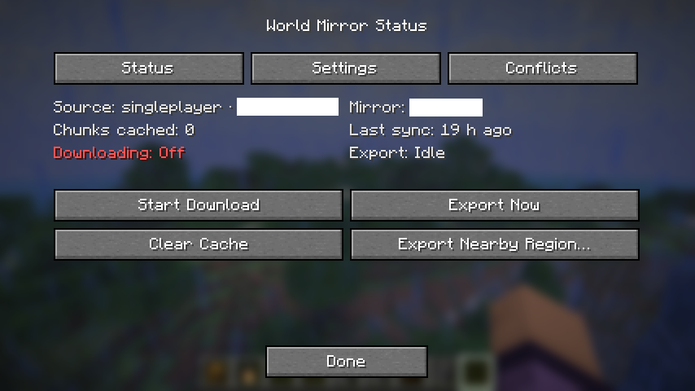
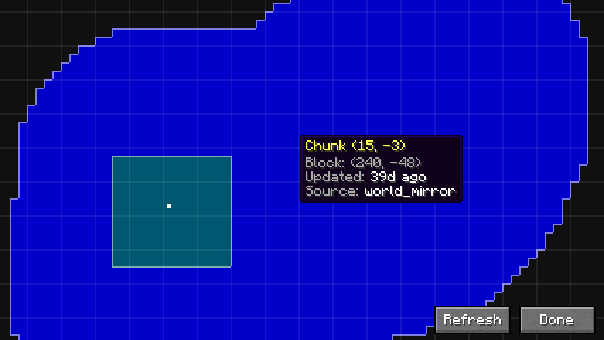
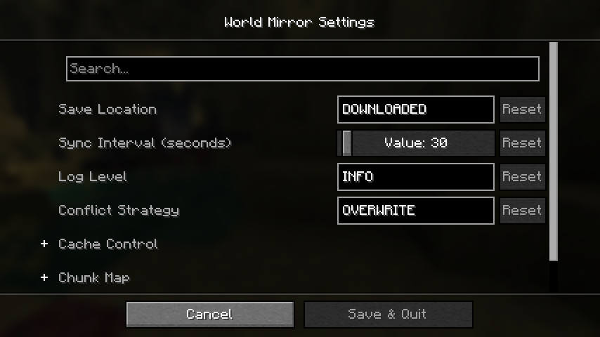
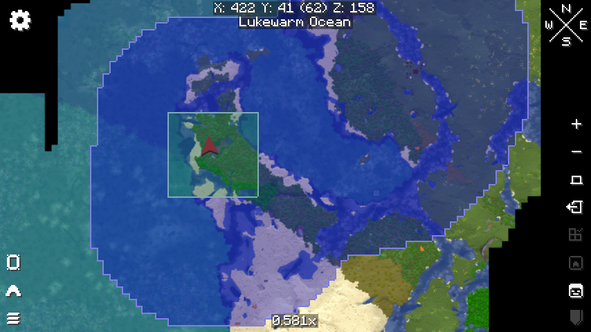

# World Mirror

**Version:** 0.3.0 · **Minecraft:** 1.21.11, 26.1.2, 26.2 · **Loader:** Fabric

A client-side Fabric mod that mirrors the world you are playing on a multiplayer server —
or even a singleplayer world — into a standard local save. As you explore, the mod captures
client-visible chunk terrain, block entities, best-effort entity snapshots, and opened
container contents. Choose the `Saves Folder` output mode to make the mirror appear directly
in Minecraft's singleplayer world list.

---

## Features

| Feature | Description |
|---------|-------------|
| **Persistent download session** | Press **P** to start or stop a download session. Chunks received from the server are recorded automatically while the session is active. |
| **Periodic background sync** | The mod exports on a configurable timer (default 30 s). Live-world capture is spread across client ticks, while region-file I/O runs on a background thread to reduce gameplay stalls. |
| **Timestamp- and source-aware writes** | SQLite records successful per-chunk write times and source priorities. Older snapshots and updates outranked by a third-party source are skipped. |
| **Multi-dimension support** | Overworld, Nether, End, and custom dimensions are exported using the save layout required by the selected Minecraft version. |
| **Entity capture** | Client-visible non-player entities are snapshotted into per-dimension entity region files on a best-effort basis. Server-only fields and the [known 0.3.0 entity reconciliation limitations](https://github.com/billstark001/world-mirror/issues/8) are not hidden. |
| **Container tracking** | The mod intercepts inventory packets when you open a chest, barrel, hopper, furnace, or any other container and saves the item stacks. They are merged into the block entity NBT on export. Double chests are handled correctly (each half is saved to its own position). |
| **Block entity data** | Signs (text), beacons (effects), banners (patterns), player heads (owner), lecterns (stored book), and all other block entities whose data the server sends to the client are persisted through Minecraft's chunk serialization path. |
| **World–mirror mapping** | Every detected server address or singleplayer world name is persistently mapped to a sanitised local folder name in `config/worldmirror/mirrors.json`. Different aliases for the same server are currently separate source IDs. |
| **Per-world settings** | Save location and conflict strategy can be overridden per world from the status screen without touching the global config. |
| **Conflict resolution** | Three built-in strategies for chunks that already exist on disk: *Overwrite* (default), *Ignore* (keep local), and *Manual* (save the server chunk to `conflict_chunks/` in MCA format for later review). |
| **Built-in Chunk Map** | Full-screen draggable and zoomable map of recorded chunks. Viewport-indexed snapshots, low-zoom bucket aggregation, and merged boundaries keep large views responsive. Colors show freshness/source; red marks unresolved conflicts. |
| **Xaero's World Map Overlay** | Optionally render the same status layer on Xaero's fullscreen map through Xaero World Map Bridge. Xaero's World Map and the bridge are both required for this integration. |
| **Export Nearby Region** | Snapshot all loaded chunks within a configurable radius (1–50 chunks) into a fresh singleplayer save with the spawn point set to your current position. |
| **Native status UI** | Press **I** to open the native Minecraft status screen. It retains download/export status, mirror information, per-world settings, safe mirror relocation, and conflict actions without a LibGui dependency. |
| **In-game logging** | Important events are echoed to the player's chat at a configurable level (Debug / Info / Warning). |
| **Cloth Config settings** | Global settings are available from the status screen. Installing Mod Menu also exposes the same screen from the title-screen mod list. |
| **Internationalisation** | UI strings are translated into English (`en_us`), Simplified Chinese (`zh_cn`), Traditional Chinese (`zh_tw`), and Japanese (`ja_jp`). |

---

## Keybindings

| Key | Action |
|-----|--------|
| **P** | Toggle download session on / off |
| **O** | Export cached data to disk immediately |
| **L** | Clear all cached chunks, entities, and containers |
| **I** | Open the in-game status screen |
| **M** | Open the chunk map directly |

All keybindings are rebindable in *Options → Controls → World Mirror*.

---

## In-Game Status Screen (I key)



The status screen shows:

- **Source info** — type (singleplayer / server), source ID, local mirror folder name
- **Statistics** — total chunks cached across all dimensions, time since last sync
- **Live status** — download active/inactive, export running/idle
- **Action buttons** — Start/Stop Download, Export Now, Clear Data, **Export Nearby Region**
- **Conflicts tab** — count of stored conflict chunks, with *Overwrite All* and *Discard All* buttons, plus **Open Chunk Map** to review conflicts per-chunk
- **Per-world settings** — save-location and conflict-strategy overrides stored in `mirrors.json`; moving an existing mirror requires confirmation and is blocked while downloading or exporting
- **Integration status** — output path and Xaero World Map Bridge availability
- **Global Settings** — shortcut to the Cloth Config-generated settings screen

---

## Built-in Chunk Map (M key)



Drag to pan, use the mouse wheel to zoom, and hover a cell to inspect its chunk
coordinates, update age, and update source. The map queries an asynchronous,
viewport-indexed status snapshot rather than the SQLite database from the render loop.
At low zoom it aggregates chunks into bounded buckets and merges same-state runs and
boundaries. Clicking a conflicted chunk opens the **Overwrite / Discard / Cancel** dialog.

---

## Configuration



Click **Global Settings** in the status screen. If Mod Menu is installed, the same screen
is also available from *Mod Menu → World Mirror → Settings*.

| Setting | Values | Default |
|---------|--------|---------|
| Save location | `Downloaded Folder` / `Saves Folder` | `Downloaded Folder` |
| Sync interval | 5–600 s | 30 s |
| In-game log level | `Debug` / `Info` / `Warning` | `Info` |
| Conflict strategy | `Overwrite` / `Ignore` / `Manual` | `Overwrite` |
| Maximum cached chunks | 0–12800; 0 disables the limit | 0 |
| Maximum cache distance | 0–64 chunks; 0 disables the limit | 32 |
| Maximum cache age | 0–14400 s; 0 disables the limit | 1800 s |
| Invalidate cache after export | `true` / `false` | `false` |
| Sparse-map cell threshold | 1–16 px | 1 px |
| Chunk-map background | `Black` / `Transparent` | `Black` |
| Xaero overlay enabled | `true` / `false` | `true` |
| Xaero overlay refresh | 1–60 s | 10 s |
| Xaero overlay max cells | 1000–50000 | 6000 |
| On join / dimension change / server-world change | `Start` / `Stop` / `Keep` | `Stop` / `Keep` / `Stop` |
| Capture nearby before export | `true` / `false` | `true` |
| Capture nearby on stop | `true` / `false` | `false` |
| Export cached chunks on stop | `true` / `false` | `false` |

Configuration is persisted in `<.minecraft>/config/worldmirror.json`.

### Optional Xaero integration

The Xaero overlay is an optional integration: World Mirror runs normally without
Xaero's World Map or the bridge. To enable it, install Xaero's World Map 1.40.x–1.44.x
and a matching Minecraft-version build from the
[Xaero World Map Bridge 0.1.0 release](https://github.com/billstark001/xaero-world-map-bridge/releases/tag/v0.1.0)
alongside [Xaero's World Map](https://modrinth.com/mod/xaeros-world-map). World Mirror's
Chunk Map settings control whether and how often its layer is rendered. The bridge's own
Mod Menu page controls exact mixin injection and the safe tail fallback; World Mirror
only supplies the chunk-status layer through the bridge API.



### Save locations

| Mode | Path |
|------|------|
| `Downloaded Folder` (default) | `<.minecraft>/downloaded_worlds/<mirror-name>/` |
| `Saves Folder` | `<.minecraft>/saves/<mirror-name>/` — immediately playable in the world list |

### Conflict strategies

| Strategy | Behaviour |
|----------|-----------|
| `Overwrite` | Server chunk always replaces the local copy |
| `Ignore` | Local copy is kept; only new chunks are written |
| `Manual` | Local copy is kept; the incoming server chunk is saved to `conflict_chunks/<dim>/r.X.Z.mca` for review. Use the Chunk Map or the Conflicts tab bulk buttons to resolve. |

---

## Output Format

The exported world is a standard Minecraft save directory. These files are common to
all supported targets:

```
downloaded_worlds/<mirror-name>/
├── level.dat                       ← Loadable world metadata
├── data/world_mirror.sqlite        ← Dirty-check and source-priority database
├── conflict_chunks/                ← Present when Manual conflicts are pending
├── resourcepacks/
└── worldmirror_meta.json           ← World Mirror metadata
```

Minecraft's dimension layout differs by target version:

| Target | Overworld | Nether | End | Custom dimension |
|--------|-----------|--------|-----|------------------|
| 1.21.11 | `<world>/` | `<world>/DIM-1/` | `<world>/DIM1/` | `<world>/dimensions/<ns>/<path>/` |
| 26.1.2 / 26.2 | `<world>/dimensions/minecraft/overworld/` | `<world>/dimensions/minecraft/the_nether/` | `<world>/dimensions/minecraft/the_end/` | `<world>/dimensions/<ns>/<path>/` |

Each dimension directory contains the target version's `region/`, `entities/`, and
`poi/` structure. World Mirror also creates the player-data and saved-data directories
required by that version.

`worldmirror_meta.json` fields:

| Field | Description |
|-------|-------------|
| `modVersion` | Mod version that created / last updated the mirror |
| `sourceType` | `singleplayer` or `server` |
| `sourceId` | `local:<level-name>` or `server:<address>` in 0.3.0 |
| `lastSyncTime` | Unix-millisecond timestamp of the most recent sync |

Per-chunk dirty-check metadata is stored in `data/world_mirror.sqlite`. Older
`worldmirror_meta.json` files with a legacy `chunkUpdateTimes` field are migrated
into SQLite on the first sync after upgrade, and the JSON field is removed.

---

## Entity Serialization

Before an export, World Mirror snapshots non-player entities currently visible to the
client and writes their client-known state to per-dimension `entities/r.X.Z.mca` files.
This covers common mobs, vehicles, paintings, item frames, armour stands, and dropped
items on a best-effort basis.

Entity output in 0.3.0 is not a server-authoritative backup. Fields never sent to the
client—such as AI internals and unopened villager trades—cannot be reconstructed.
Type-ID persistence and move/despawn reconciliation also have a
[known 0.3.0 correctness issue](https://github.com/billstark001/world-mirror/issues/8).
Do not rely on the mirror as the sole backup of important entities until that issue is
resolved.

---

## Block Entity Serialization

Block entities are serialized through Minecraft's chunk saving path
(`getBlockEntityNbtForSaving` / `SerializableChunkData`):

- **Signs / Hanging signs** — front and back text, waxed and glow-ink flags
- **Beacons** — primary and secondary effect IDs
- **Banners** — all pattern layers
- **Player heads / Skulls** — owner profile
- **Lecterns** — stored book item
- **All other block entities** — any state the server sends to the client

Container inventories (chests, barrels, hoppers, furnaces, etc.) are handled separately
by the `ContainerTracker`, which intercepts inventory packets when the player opens each
container during the session. Previously captured non-empty container item data is
preserved when later client block-entity snapshots are empty, and default GUI titles such
as `container.chest` are not persisted as custom names.

---

## Capture Limits in 0.3.0

World Mirror is client-side and cannot reconstruct data the server never sends. In
particular:

- unopened container inventories, server-only entity fields, structure metadata, and
  server datapack definitions may be absent;
- entity type IDs and move/despawn reconciliation have a tracked
  [correctness issue](https://github.com/billstark001/world-mirror/issues/8);
- light sections present in the initial chunk packet are saved, but later light-only
  updates are not yet tracked reliably ([issue #9](https://github.com/billstark001/world-mirror/issues/9));
- uncaptured chunks intentionally remain void, while the generated save's climate and
  dimension metadata can differ from the source world
  ([issue #5](https://github.com/billstark001/world-mirror/issues/5)).

---

## Installation

Choose the World Mirror JAR that exactly matches your Minecraft version:

| Minecraft | Java |
|-----------|------|
| 1.21.11 | 21 or newer |
| 26.1.2 | 25 or newer |
| 26.2 | 25 or newer |

1. Install [Fabric Loader](https://fabricmc.net/use/) 0.19.3 or newer.
2. Install the matching [Fabric API](https://modrinth.com/mod/fabric-api).
3. Put the matching World Mirror 0.3.0 JAR in `mods/`.
4. *(Optional)* Install [Mod Menu](https://modrinth.com/mod/modmenu) for a title-screen settings entry.
5. *(Optional)* For the Xaero overlay, install both
   [Xaero's World Map](https://modrinth.com/mod/xaeros-world-map) 1.40.x–1.44.x and the
   matching [Xaero World Map Bridge 0.1.0](https://github.com/billstark001/xaero-world-map-bridge/releases/tag/v0.1.0).

Cloth Config and SQLite JDBC are bundled in the World Mirror JAR. LibGui is not used
and does not need to be installed.

---

## Typical Usage

1. Join a multiplayer server.
2. Press **P** — the action bar shows *World Mirror: Active*.
3. Walk around to load terrain.  Open containers to capture their inventories.
4. Press **I** to check sync statistics and status at any time.
5. Press **O** for a final export, then press **P** to stop the session. Automatic export
   on stop is available but disabled by default.
6. The mirror is saved under `<.minecraft>/downloaded_worlds/<mirror-name>/` by default.
   To play offline, open the world from the
   *Saves Folder* (set save location to `Saves Folder` in settings, or copy the folder
   manually to `<.minecraft>/saves/`).

### Quick export (no session)

Press **O** at any time to trigger an immediate export, even when no download session
is active. With the default lifecycle settings, the mod first queues a small loaded area
around the player for capture.

### Starting fresh

Press **L** to clear the in-memory chunk, entity, and container caches. This does not
delete or reset any mirror data already written to disk.

---

## Building

```bash
./gradlew buildAll
```

This builds the Fabric targets for Minecraft 1.21.11, 26.1.2, and 26.2. Each
target's artifacts are stored in its `versions/fabric-*/build/libs` directory.

For a Modrinth upload, build all targets and collect only the three distributable
JARs in the root [`build/modrinth`](build/modrinth) directory:

```powershell
.\scripts\build-modrinth.ps1
```

Use `-SkipBuild` only when the current version's three JARs have already been built.

---

## Architecture Notes

- All chunk data is captured on the game thread in `ChunkDataMixin` and stored in
  `ChunkListener` (dimension-aware: `Map<ResourceKey<Level>, Map<ChunkPos, CapturedChunk>>`).
- Container data is captured in `ContainerMixin` and stored in `ContainerTracker`.
- Entities are snapshot-serialized on the game thread by `EntityTracker` before each export.
- Built-in and Xaero rendering share `ChunkMapView` and use asynchronous status
  snapshots, viewport-indexed lookups, low-zoom bucket aggregation, coalesced fill runs,
  and merged boundaries.
- Xaero's World Map overlay is optional and uses Xaero World Map Bridge's public overlay API; the bridge owns Xaero-specific mixins and fallbacks.
- The actual disk I/O runs on a background thread (`WM-Export`) to reduce gameplay
  stalls. The game thread incrementally captures live chunks and provides immutable
  snapshots of chunks, entities, and container overlays to the writer.
- The dirty-check (`CapturedChunk.capturedAtMs` vs `data/world_mirror.sqlite`) ensures
  unchanged chunks are not re-written on every periodic sync.
- Region files are read and written using the bundled MIT-licensed
  [ens-gijs/NBT](https://github.com/ens-gijs/NBT) fork of
  [Querz/NBT](https://github.com/Querz/NBT).

## License

MIT

